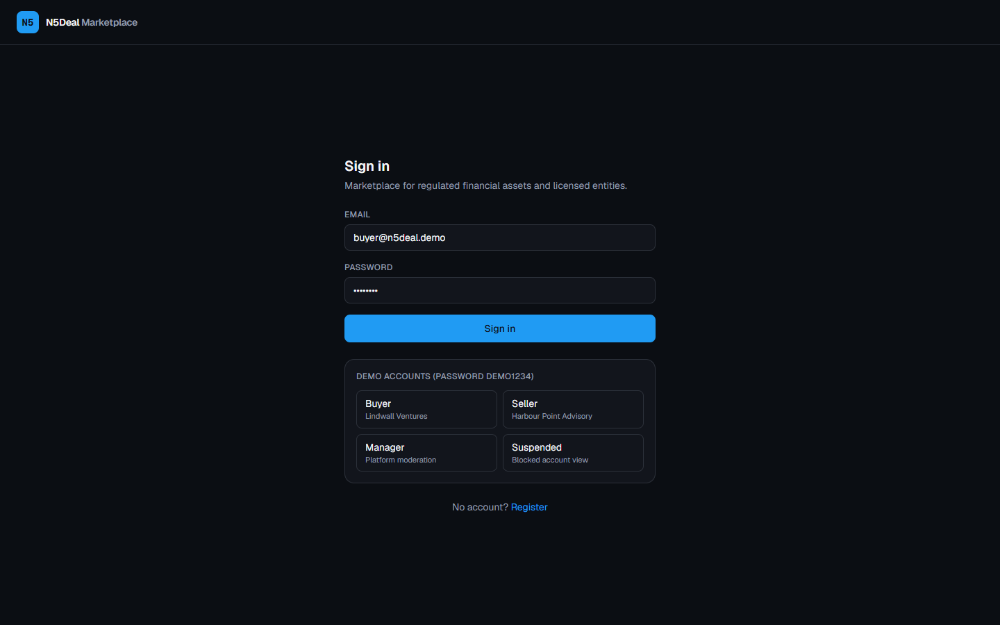
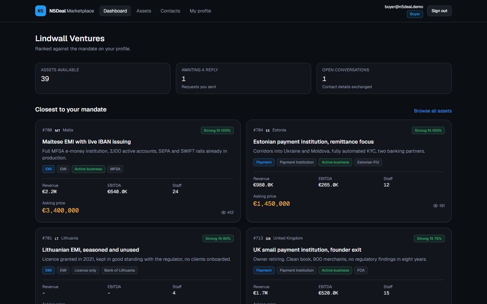
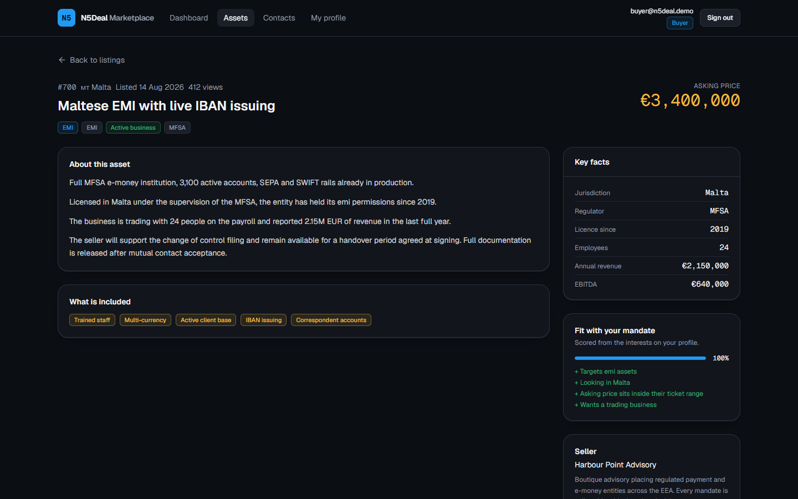
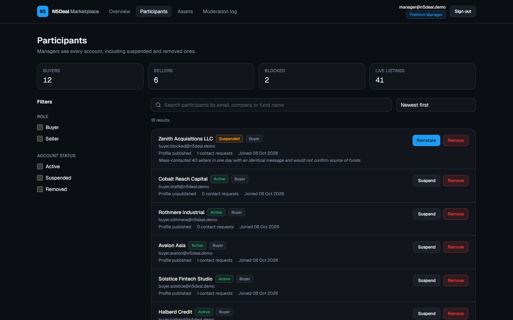
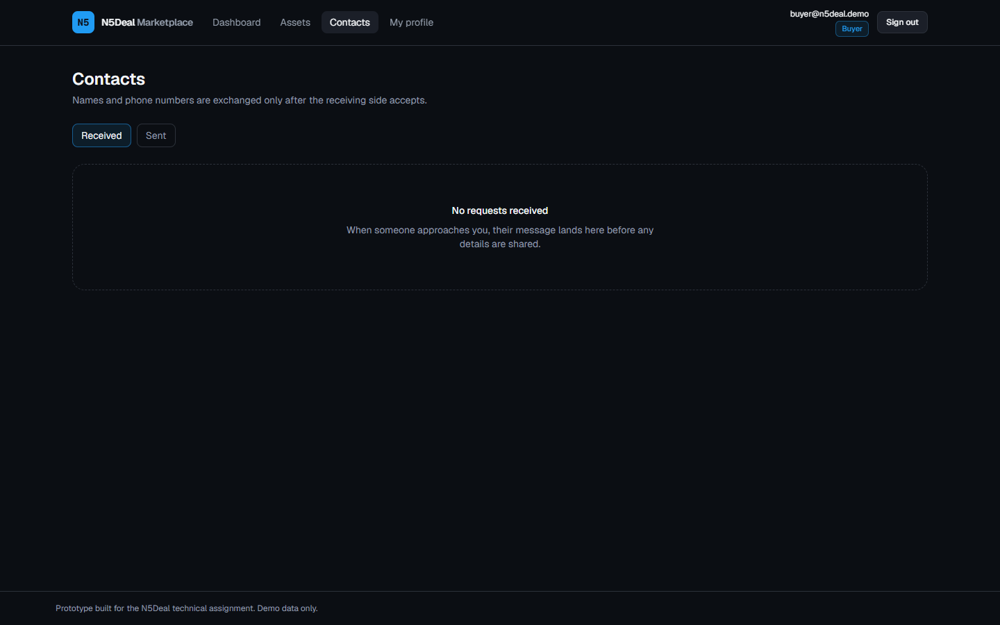

# N5Deal Marketplace Prototype

A working marketplace for M&A in regulated financial services: licensed entities and
operating businesses listed by sellers, mandates published by buyers, and a platform
manager who moderates both sides.

Built as a technical assignment, so it is a prototype rather than a production system.

## Screenshots

**Sign-in with one-click demo accounts**


**Buyer dashboard, assets ranked against the mandate**


**Asset page with mandate fit breakdown**


**Platform manager: participant moderation**


**Contact requests between buyers and sellers**


## Run it

Needs Node 18.18 or newer. Nothing external to configure, the database is a local SQLite
file.

```bash
npm install
cp .env.example .env      # Windows: copy .env.example .env
npm run db:setup          # creates prisma/dev.db, applies migrations, seeds demo data
npm run dev
```

Open http://localhost:3000, or http://127.0.0.1:3000 if your machine resolves `localhost`
to IPv6 first. `npm run db:reset` wipes and reseeds; the seed is deterministic so the
demo looks identical every time.

`.env.example` ships with a working local `DATABASE_URL` and a throwaway `AUTH_SECRET`,
so the copy above is all the setup there is.

### Demo accounts

Password for all of them is `demo1234`. The sign-in screen has one-click buttons for the
first four.

| Role | Email | What you see |
| --- | --- | --- |
| Buyer | `buyer@n5deal.demo` | Published mandate, ranked assets, open conversations |
| Seller | `seller@n5deal.demo` | Five live listings, one draft, incoming requests |
| Platform manager | `manager@n5deal.demo` | Participants, all assets, moderation log |
| Suspended buyer | `buyer.blocked@n5deal.demo` | The blocked-account view with its reason |
| Buyer, unpublished | `buyer.draft@n5deal.demo` | The onboarding gate before a profile goes live |

Demo data: 19 accounts, 43 assets across 20 jurisdictions, 17 contact requests in every
status, two blocked participants with real moderation reasons behind them.

## Scope

I built fewer things properly instead of more things thinly. Three roles, a persistent
data model, working search on both sides of the marketplace, and a contact flow with a
gate that means something. No AI features, no i18n, no automated tests; those are in the
list at the bottom.

**Buyer** maintains a mandate (categories, jurisdictions, ticket range, entity
preference, free-text thesis), browses and filters assets, sees a fit score against their
own mandate, and contacts sellers.

**Seller** publishes assets through a draft/publish lifecycle, browses and filters
buyers, sees which published buyers fit their latest listing, and contacts them.

**Platform manager** searches participants and assets including everything hidden from
the market, suspends, reinstates and removes participants, suspends and republishes
individual listings, and reads an append-only moderation log.

### Where to look

If you only have ten minutes, these five files carry most of the thinking:

| File | Why |
| --- | --- |
| [`src/lib/auth/policies.ts`](src/lib/auth/policies.ts) | Every non-trivial permission rule, as pure functions |
| [`src/lib/search/params.ts`](src/lib/search/params.ts) | The facet engine behind all three catalogues |
| [`src/app/actions/moderation.ts`](src/app/actions/moderation.ts) | Suspend, remove and the cascade each one triggers |
| [`src/lib/match.ts`](src/lib/match.ts) | Fit scoring, deterministic and explainable |
| [`prisma/schema.prisma`](prisma/schema.prisma) | The data model and the constraints doing real work |

## Key technical decisions

**Next.js App Router with server components and server actions, no API layer.**
Pages behind a session are server components that query Prisma directly, and every
mutation is a server action. A REST or tRPC layer in between would only forward calls.
The price is coupling to Next, which is the right trade at this size.

**SQLite through Prisma.** It makes `npm install && npm run db:setup && npm run dev`
work on a clean machine with no Docker, no connection string and no cloud account. Two
SQLite limitations shaped the schema:

- *No native enum type.* Enum-like columns are TEXT and
  [`src/lib/domain/enums.ts`](src/lib/domain/enums.ts) holds the tuples that the
  TypeScript unions, the zod validators and the UI option lists are all derived from.
  Where an action accepts only part of an enum, such as registration excluding the
  manager role, it narrows the same tuple rather than retyping the members.
- *No scalar lists.* A buyer's categories and jurisdictions are join tables. Filtering is
  an indexed JOIN instead of a `LIKE` over a serialised blob, and adding a jurisdiction
  is a seed change rather than a code change.

Moving to Postgres is a provider swap plus native enums. A handful of places lean on
SQLite semantics (case-insensitive `LIKE`, NULLs distinct in unique indexes, NULL sort
order) and all of them carry a comment.

**Search state lives in the URL.** That is what makes a filtered view survive a refresh,
open correctly in a new tab and work as a shareable link, which is the real requirement
behind "state should persist after refresh".
[`src/lib/search/params.ts`](src/lib/search/params.ts) parses the query string against a
declared facet config and drops anything not in it, so a hand-edited URL cannot put an
unexpected value into a database query.

**One search engine, three surfaces.** Buyers filtering assets, sellers filtering buyers
and the manager filtering participants are the same problem. Facet definitions, URL
round-trip, filter panel, chips and pagination are shared in
[`src/components/search/catalogue.tsx`](src/components/search/catalogue.tsx); only the
Prisma where-clause differs.

**Authorisation is a policy module.**
[`src/lib/auth/policies.ts`](src/lib/auth/policies.ts) holds pure functions with no
database and no session: `canViewAsset`, `canContactSeller`, `contactDetailsVisible`.
[`src/lib/auth/guards.ts`](src/lib/auth/guards.ts) is the only place a session is read.
Pages and server actions go through those two files.

**Suspension is re-checked every request.** The JWT holds the user id and role; account
status is read from the database inside `currentUser()`, deduplicated per request with
React `cache`. A suspension takes effect on the next click instead of when the token
expires.

**Suspend, remove and archive mean different things.** Suspending a participant does not
touch their listings: catalogue queries filter on `seller.user.status`, so the seller
drops out of the market and reinstating them restores everything with no second pass.
Removal is a soft delete, marking the account `REMOVED`, archiving listings and closing
open requests. A listing suspended on its own keeps that state through a removal so the
reason stays visible. Nothing is physically deleted, because a marketplace has to answer
questions about a deal months later, and the moderation log stores a denormalised label
so entries stay readable after their subject is gone.

**Contact details are the product, so they are gated.** A request carries a message and
nothing else. Names, emails, phone numbers and websites are released to both sides only
once the receiving side accepts. Declining tells the other party and leaks nothing. The
answer is written as a conditional update on the PENDING row, so a double submit cannot
turn a decline into an accept, and unique indexes on `(initiatorId, assetId)` and
`(initiatorId, buyerProfileId)` stop duplicate outreach in the database.

**Two levels of validation on the same form.** Saving a draft is permissive. Publishing
is where the requirements bite: a buyer profile needs a headline, a real thesis, at least
one category and jurisdiction and a ticket range; a listing needs a summary, a full
description, revenue for a trading business and EBITDA that does not exceed it. The rule
set lives in one function and is reused when a listing is published from the table rather
than from the form.

**Fit scoring is deterministic and explained.**
[`src/lib/match.ts`](src/lib/match.ts) scores an asset against a mandate on category,
jurisdiction, ticket range and entity preference, and returns the reasons and the misses
next to the number. Buyers see it on listings, sellers see which buyers fit their newest
asset. Candidates are narrowed in SQL before scoring so recency does not hide a strong
match further down the catalogue.

**Visual direction.** N5Deal does not publish extractable brand tokens, so I matched the
dark, data-dense fintech look of the live site and the shape of its listing cards:
reference number, jurisdiction flag, licence type, business status, regulator, asking
price in EUR, included benefits, view count. The palette is HSL variables in
`globals.css` surfaced as Tailwind tokens.

## Data model

```
User --+-- BuyerProfile --+-- BuyerCategory -- Category
       |                  +-- BuyerCountry  -- Country
       +-- SellerProfile ---- Asset --+-- Category
                                      +-- Country
                                      +-- AssetBenefit -- Benefit

ContactRequest -- initiator/target Users, plus either an Asset or a BuyerProfile
ModerationAction -- actor User, denormalised target label, reason, timestamp
```

- Money is whole EUR in `Int` columns. Single currency is an assumption, not an oversight.
- `Asset.reference` is the public `#742` number. It is allocated from `max() + 1` and
  retried on the unique-index collision, because SQLite will not serialise the read
  against a concurrent insert.
- `ContactRequest` holds exactly one of `assetId` or `buyerProfileId`. SQLite treats
  NULLs as distinct, so a buyer-to-seller request never blocks a seller-to-buyer one.
- Lookup tables (`Category`, `Country`, `Benefit`) carry the facet vocabulary, including
  ISO country codes used to render flags without shipping image assets.

## Assumptions

- Manager accounts are provisioned by N5Deal, not through the public registration form.
- Buyers browse assets, sellers browse buyers. Managers use the admin views for both.
  Strict role separation keeps the navigation and the permission model simple.
- A buyer profile must be published before it can be seen or used to contact anyone. That
  forces the onboarding which populates the second side of the marketplace.
- Everything is priced in EUR, matching the live N5Deal listings.
- No email delivery, no NDA workflow, no document room, no payments. A contact request is
  where this prototype stops and a real deal process begins.
- Passwords are bcrypt-hashed and sessions are JWT cookies. There is no email
  verification, no password reset and no rate limiting; all three are deliberate
  omissions and are listed below.
- View counts are incremented after the response is sent, with no per-viewer
  deduplication. Good enough to make the counter real, not good enough to bill on.

## AI tools

I used Claude Code (Opus) throughout, under a per-file plan I wrote first. The product
and architecture calls are mine: the role model, the shared search abstraction, gating
contact details behind acceptance, the suspend-versus-remove semantics, and normalising
facets instead of serialising them.

Two things worth naming. I read the live N5Deal listing page before designing the schema,
which turned a generic industry-and-EBITDA model into licence type, regulator, business
status and included benefits. And the scaffolded `next@15.5.4` shipped with a published
CVE on a Node 18 machine, so the stack is pinned to the patched 15.5.x line with Tailwind
v3 and a `postcss` override; `npm audit` reports zero.

I also ran adversarial review passes over the finished code and triaged them myself,
which is where the contact-response race, the login redirect loop for removed accounts
and the one-way archive button came from. I declined a fair chunk of the rest, and those
declines are in the assumptions above.

## What I would do with more time

1. **Tests.** Vitest over the policy module and the search where-clause builders, which
   are pure and are where a silent regression would hurt. Then Playwright for the three
   role journeys I currently verify by hand.
2. **Postgres and real full-text search,** with facet counts next to each filter option.
3. **NDA gate before the data room.** Contact acceptance is the right first step; a real
   deal needs a signed NDA before detailed financials.
4. **Notifications** on incoming requests and moderation decisions, through a queue
   rather than inline in the server action.
5. **Narrow the enum strings once at the query boundary** instead of casting at each read
   site, now that the write path already validates them.

## Project layout

```
prisma/
  schema.prisma          data model
  seed.ts                deterministic demo data
src/
  app/
    (auth)/              sign in, register
    (app)/               everything behind an active account
    suspended/           the one page a blocked account can still reach
    actions/             server actions: auth, profile, asset, contact, moderation
  components/
    search/              catalogue shell, facet panel, chips, pagination
    asset/ buyer/ contact/ admin/ ui/ layout/
  lib/
    auth/                guards (session) and policies (pure rules)
    domain/              enum tuples and reference data
    search/              facet configs and where-clause builders per surface
    match.ts             fit scoring
```

## Scripts

| Command | What it does |
| --- | --- |
| `npm run dev` | Development server |
| `npm run build` | Production build |
| `npm run db:setup` | Migrate and seed from empty |
| `npm run db:reset` | Drop, migrate and reseed |
| `npm run typecheck` | `tsc --noEmit` |
| `npm run lint` | ESLint |
